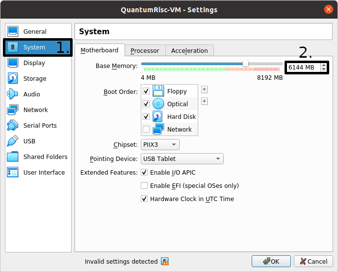
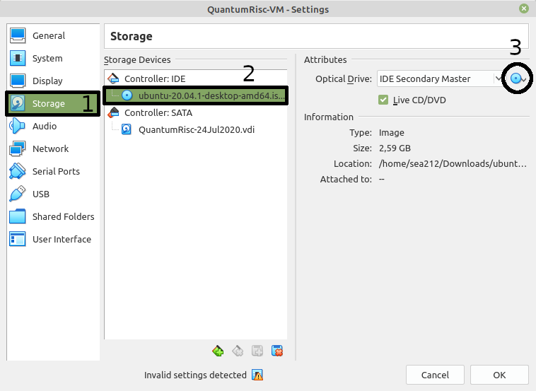

Creating a QuantumRisc-VM
=========================

In this section you can learn how to setup a virtual machine, how to configure the tool and project installation script and finally how to start the fully automatic QuantumRisc-VM setup process.

Prerequisites
-------------

* `VirtualBox <https://www.virtualbox.org/wiki/Downloads>`__ (tested with version 6.1.10_Ubuntu r138449)
* `VirtualBox Guest Additions <https://download.virtualbox.org/virtualbox/>`__
* `Ubuntu 20.04 LTS setup iso <https://releases.ubuntu.com/20.04.1/ubuntu-20.04.1-desktop-amd64.iso>`__
* `VM build tools <https://github.com/sea212/QuantumRisc-VM-Build-Tools/tree/master/build_tools>`__
* >6GB RAM
* >70GB hard disk space (~54GB for the VM, ~12GB to archive it)

Preparing the VM
----------------

Follow the instructions on `how to install Ubuntu 20.04 LTS <https://fossbytes.com/how-to-install-ubuntu-20-04-lts-virtualbox-windows-mac-linux/>`__, but instead of allocating 30GB of disk space, choose at least 60GB. You can set the username and password both to "quantumrisc". After the successful installation of Ubuntu and all tools and projects, about 54 GB are used up. In case you selected 60GB, about 6GB are still available for the end user to download and install addtional software. During the installation of the tools and projects, the disk will use up to almost 60 GB temporarily.

After the successful installation of `Ubuntu 20.04 LTS <https://releases.ubuntu.com/20.04.1/ubuntu-20.04.1-desktop-amd64.iso>`__ and the `VirtualBox Guest Additions <https://download.virtualbox.org/virtualbox/>`__ on the VM, shutdown the VM and follow the instructions from section :ref:`usage-setting-up-vm`. In addition to those instructions, you also have to raise the available memory for the VM to at least 6GB. To achieve this, select the VM and enter the *Settings* dialogue:

.. image:: pictures/using_the_vm/setting_up_vm/select_settings.png

Switch to the *System* tab in the left menu and set the base memory to 6144 MB or more:

If you have not already removed the Ubuntu iso image from the virtual optical drive, the virtual machine will try to boot from it first. You can remove it in the *Storage* section of the *Settings* dialogue. Click on the image under the IDE Controller, next click on the disk image in the *Attributes* section and finally select "Remove Disk from Virtual Drive" in the dialogue. Since no virtual disk or floppy is detected now, the VM will boot from the virtual hard drive:

If you still experience issues booting your VM, try to change the *Boot Order* in the *System* section of the *Settings* dialogue. Give the *Hard Disk* the highest priority (top) and see if your VM boots. Note that your VM will now ignore virtual floppy or disk images during the boot process.

Start your VM and upgrade any packages on it and the kernel if desired:

``sudo apt update && sudo apt upgrade -y && sudo apt dist-upgrade && sudo apt autoremove -y``

Configuring and running the fully automatic install procedure
-------------------------------------------------------------

Copy the folder *build_tools* from the `QuantumRisc-VM git project <https://github.com/sea212/QuantumRisc-VM-Build-Tools>`__ to */opt/QuantumRisc-Tools*. Change the current directory to */opt/QuantumRisc-Tools/build_tools*.

Configure the fully automated and configurable tools and project install script as desired. Instruction can be found on section :ref:`fully-automated-script` of the scripts chapter. After an adequate configuration was created, run the install script with the desired flags (usually *-c* is enough), as explained in section :ref:`fully-automated-script-usage` of the scripts chapter:

``sudo ./install_everything.sh -c``
	
Finally, clean up traces you left during the setup:

- browser history
- temporary files which are not required anymore
- command line history by using the command ``history -c && history -w``
