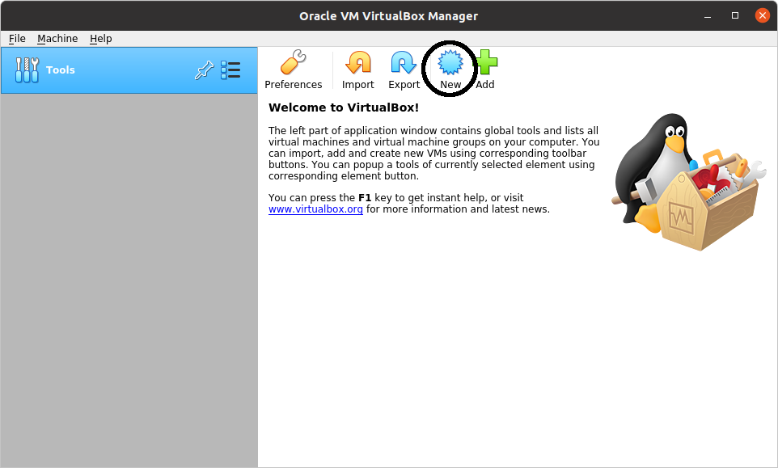
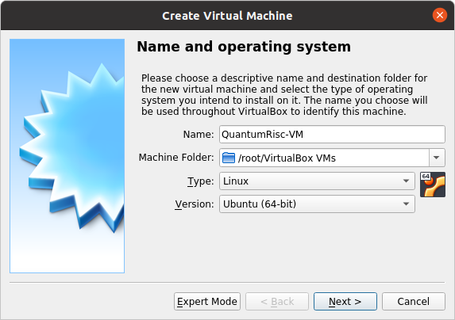
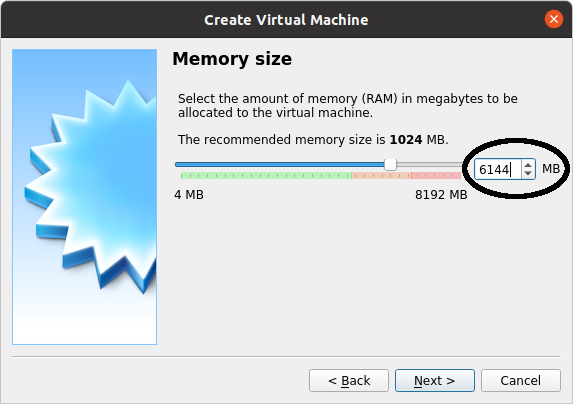
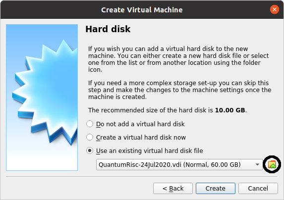
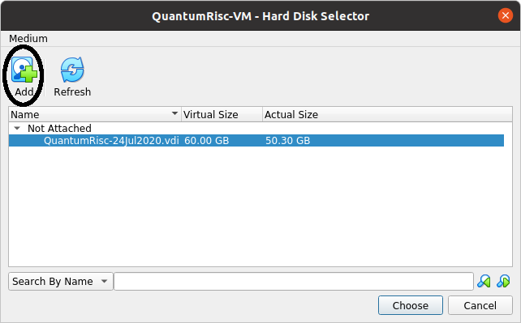
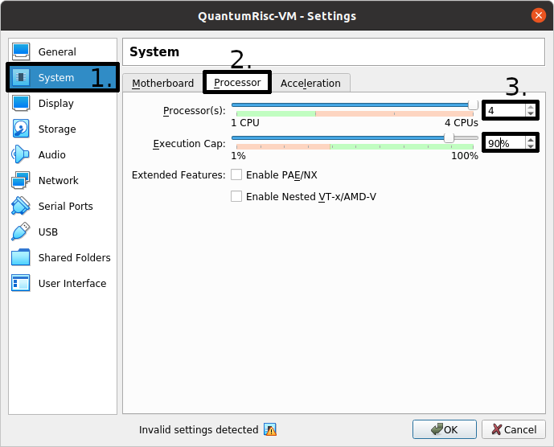
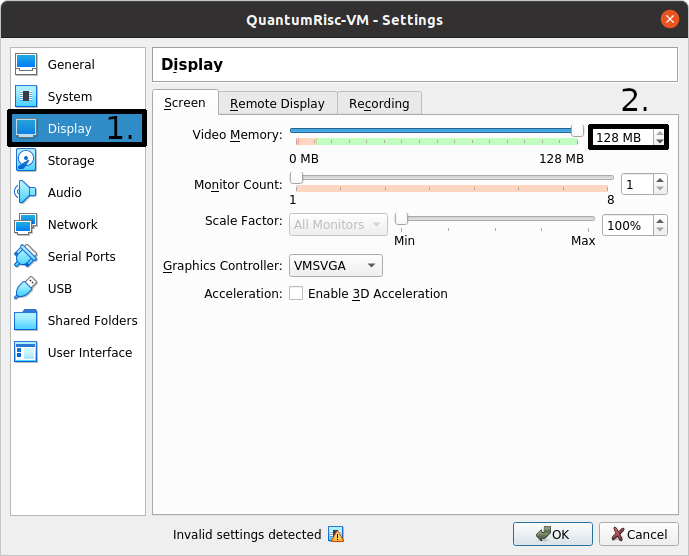
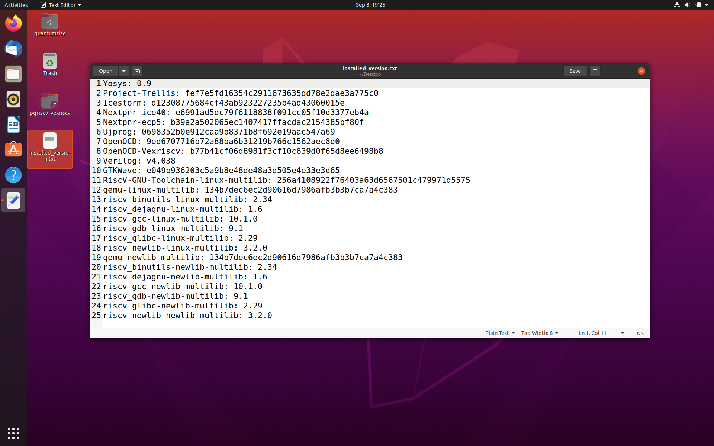

Using a QuantumRisc-VM
======================

This Chapter deals with the download, setup and usage of a QuantumRisc-VM. The list of tools and projects included in the VM might vary from version to version, but should be included at the download page. Additionally, the tools are listed in chapter :doc:`script_and_configuration_index` and in a version file at the desktop of the VM.

.. _usage-prerequisites:

Prerequisites
-------------

* `QuantumRisc-VM <https://random-oracles.org/risc-v/>`__
* `VirtualBox <https://www.virtualbox.org/wiki/Downloads>`__ (tested with version 6.1.10_Ubuntu r138449)
* >70GB hard disk space

Setup
-----

Download and and extract the QuantumRisc-VM from the link mentioned in :ref:`usage-prerequisites`. You can get yourself a coffee or a tee, because the archive is >10GB large and the extraction takes more than half an hour. Also install VirtualBox, following the instructions given at the vendors page.

.. _usage-setting-up-vb:

Setting up VirtualBox
~~~~~~~~~~~~~~~~~~~~~
Start VirtualBox and select "new" in the toolbar to add the QuantumRisc-VM image:

Give the Virtual Machine a name and data folder:

Select the amount of RAM to assign to the VM (this can be changed later). A value too low can lead either to a dysfunctional VM or massive swapping of RAM contents to the hard drive, which slows the machine down. A value too high has the same effects on the hosting machine. To use the VM, 4GB should be enough. Be aware though that building the VM requires 6GB or more of RAM, otherwise the build will fail at the RiscV toolchain (more information at chapter :doc:`direct_usage_of_the_scripts`).

Select "use an existing virtual hard disk file" and press on the folder icon:

A new dialogue should open. Select "Add" and select the previously downloaded and extracted QuantumRisc-VM image:

Press on "create". Your VM has now been created and can be used. Before you use it, you should configure it as instructed in the section :ref:`usage-setting-up-vm`.

.. _usage-setting-up-vm:

Setting up QuantumRisc-VM
~~~~~~~~~~~~~~~~~~~~~~~~~
After finishing the steps provided to setup VirtualBox as specified in :ref:`usage-setting-up-vb`, a virtual machine that mounts the QuantumRisc-VM image has been created. Now we are going to assign processors and the execution cap, video memory and USB access.

Start by selecting the VM from the list of available VMs and click on the cogwheel icon:

.. image:: pictures/using_the_vm/setting_up_vm/select_settings.png

To configure the processor count and usage cap, click on "System" in the left list of categories. Select the "Processor" tab. You can specify the number of processors and the execution cap. You might not want to select 100% execution cap in case you have selected all available processors, because that might slow down or even temporarily freeze your host system.

Next select the "Display" category and specify the video memory. To avoid graphical lags you should assign as much as you can provide. You can also configure multiple monitors in that dialogue.

Complete the configuration by making sure that USB connections are passed through to your VM. This is only relevant if you want to work with devices connected over USB, for example to flash a FPGA. If it is required, you can also connect virtual devices to real serial ports in the VM settings.

.. image:: pictures/using_the_vm/setting_up_vm/configure_usb.png

Usage
-----
After setting VirtualBox and the QuantumRisc-VM up, the VM is ready to use. Start the VM, the superuser credentials can be found at the QuantumRisc-VM download page. You might want to change the display resolution. This can be achieved by clicking on "Activities" in the top left corner, typing "displays" and pressing enter. You can switch between fullscreen and scaled mode by pressing hostkey + F and hostkey + S respectively. By default, the hostkey is mapped to right CTRL. If you experience graphical issues, switching to scaled mode (hostkey + S) and configuring the displays within the VM might resolve the issues.

After launching the VM you see the desktop containing a version file and symbolic links to folders:

The version file contains a version dump of all the tools that are available on the VM. All these tools are already configured and installed properly and can be used out of the box.
The symbolic links to folders are links to projects that have been selected to be included into the VM by default. Those are usually projects that are being developed currently or assist during development. One of the default projects is an "Hello World" project, which serves as testkit to automatically test most of the tools that are available on the VM. This project is described in the next section :ref:`usage-hello-world`

.. _usage-hello-world:

Hello World
~~~~~~~~~~~
A demo application which uses most if not all of the tools on the VM will be included in the next version.
